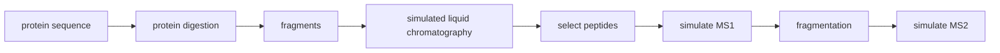

# Proteosim Course Package

## Package description
This repository provides a simulation framework for mass-spectrometry–based proteomics experiments. It focuses on modeling protein digestion, LCiquid chromatography, realistic MS1/MS2 spectra as well as ion fragmentation of peptides. The code is under active development and is continuously being expanded and improved.

