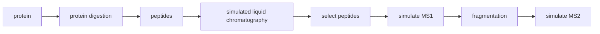

# proteosim Course Package

## package description
proteosim is a modular Python package that provides a simulation framework for mass-spectrometry–based proteomics experiments. It focuses on modeling protein digestion, Liquid chromatography, realistic MS1/MS2 spectra as well as ion fragmentation of peptides. The code is under active development and is continuously being expanded and improved.

## workflow

### Input
- FASTA files containing one or multiple protein sequences
- Optional configuration parameters:
- Enzymes and digestion patterns
- Retention-time model parameters
- masses of amino acids

### Processing Steps
- Enzymatic Digestion
- Simulates tryptic or user-defined enzymatic digestion
- Predicts peptide retention times for liquid Chromatography Simulation
- Mass Spectrometry Simulation
- Calculates molecular masses and mass to charge ratios
- Simulates MS1 intensity profiles
- Generates MS2 fragmentation spectra
- Produces tables of peptide fragements andm/z values

### Output
- Peptide tables (CSV/TSV/DataFrame) containing m/z after MS1 and MS2
- Simulated MS1 spectra
- Simulated MS2 fragment spectra
- m/z tables for downstream analysis

## overview of functions

### protein digestion
- ps.read_fasta: Provides tools for reading FASTA files.
- ps.digest_protein_collection: Implements enzymatic digestion logic.

### liquid chromatography
- ps.plot_retention_time: plots simulated liquid chromatography
- ps.select_retention_time_window: Filters peptides by length and cleavage rules

### MS1 simulation
- ps.calculate_mol_mass_collection: calculates molecular masses
- ps.calculate_mz_collection: calculates mass to charge ratio
- plot_ms1 = ps.plot_ms1: plots ms1 spectra

### MS2 simulation
- ps.fragment_peptide: simulates peptide fragmentation

## end-to-end example
A complete example demonstrating the full workflow can be found at:\
You can find the full workflow example in [End-to-end example notebook](ms_experiment_final.ipynb).

This notbook shows how to: 
- Load proteins from FASTA
- Digest them
- Model retention times to conduct a simulated liquid chromatography
- Simulate MS1 and MS2 data

## requirements
pip install -r requirements.txt\
pip install .

