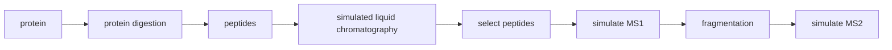

# proteosim Course Package

## package description
proteosim is a modular Python package that provides a simulation framework for mass-spectrometry–based proteomics experiments. It focuses on modeling protein digestion, Liquid chromatography, realistic MS1/MS2 spectra as well as ion fragmentation of peptides. The code is under active development and is continuously being expanded and improved.

## workflow

### Input
FASTA files containing one or multiple protein sequences /n
Optional configuration parameters:
Enzyme and digestion rules
Miscleavage settings
Retention-time model parameters
MS instrument settings
Fragmentation rules
Processing Steps
Enzymatic Digestion
Simulates tryptic or user-defined enzymatic digestion
Controls miscleavages, minimum/maximum peptide length
Produces peptide sequences with basic physicochemical properties
Chromatography Simulation
Predicts peptide retention times (sequence- or model-based)
Generates chromatographic elution profiles
Optional visualization of chromatographic curves
Mass Spectrometry Simulation
Calculates monoisotopic masses and charge states
Simulates MS1 intensity profiles
Generates MS2 fragmentation spectra (b/y ions, depending on method)
Produces tables of m/z values and intensities

### Output
Peptide tables (CSV/TSV/DataFrame) containing sequences, masses, RTs, and properties
Simulated MS1 peak lists
Simulated MS2 fragment spectra
m/z tables for downstream analysis
Optional plots of chromatographic traces or spectra

## overview of functions
proteosim.fasta
Provides tools for reading and parsing FASTA files.
load_fasta(path): Loads sequences from a FASTA file
Handles header parsing and sequence validation
proteosim.digestion
Implements enzymatic digestion logic.
digest(sequence, enzyme="trypsin", max_miscleavages=2)
Filters peptides by length and cleavage rules
Computes basic peptide properties
proteosim.chromatography
Models chromatographic behavior of peptides.
predict_rt(peptides): Predicts retention times
elution_profile(peptide): Generates simulated elution curves
Optional helper functions for visualization
proteosim.ms
Contains mass spectrometry simulations.
simulate_ms1(peptides, ...): Produces MS1 peak lists
fragment(peptide, method="CID"): Generates b/y fragment ions
simulate_ms2(peptides, ...): Produces MS2 spectra based on fragmentation rules
proteosim.analyzers
Helper functions for downstream analysis.
Peak picking
Spectrum annotation
Data transformation utilities
proteosim.utils
General helper utilities.
Mass calculation helpers
Amino-acid property tables
Sequence manipulation utilities

## end-to-end example
A complete example demonstrating the full workflow can be found at:
tutorials/ms_experiment_final.ipynb
This notebook shows how to:
Load proteins from FASTA
Digest them
Model retention times
Simulate MS1 and MS2 data
Inspect and analyze the generated outputs

## requirements
pip install -r requirements.txt
pip install .

